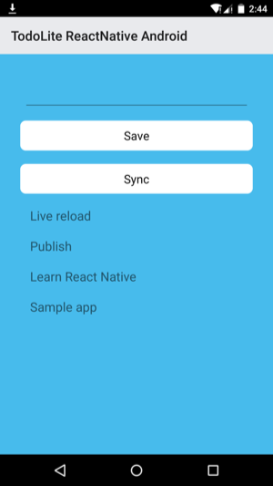

# Getting Started with React Native Android and Couchbase Lite

[React Native](http://facebook.github.io/react-native/) enables you to build Android applications that look and feel native with only JavaScript. In this instance, React Native takes care of managing UI state and synchronizing it with the models. And luckily for us, we can use [Couchbase Lite](http://developer.couchbase.com/documentation/mobile/1.1.0/get-started/couchbase-lite-overview/index.html) to add sync and persistence to a React Native app. In this tutorial, you will learn how to build a simple application to save documents and replicate them to [Sync Gateway](http://developer.couchbase.com/documentation/mobile/1.1.0/get-started/sync-gateway-overview/index.html). Here are the core concepts you will learn:

- Create a basic project with Couchbase Lite Android and Couchbase Lite Java Listener
- Integrating React Native in your project
- Adding Models and UI components with JavaScript
- Setting up Couchbase Sync Gateway

Here's a sneak peek of what you are going to build:


You can download the completed project from [GitHub](https://github.com/atom992/CBL4RNTodoDemoAndroid).

## Prerequisites

- Node.js 4.0 or higher
- [Android Studio](http://developer.android.com/sdk/installing/studio.html) and an emulator

## Getting Started

In this section, you will create a new Android Studio project from scratch and [integrate React Native](https://facebook.github.io/react-native/docs/embedded-app-android.html#content) to it.

### New Android Studio Project

Before you start writing some JavaScript you need to create a new Android Studio project with all the dependencies. Open Android Studio and from the welcome screen select **New Project**. In the New Project window, enter **TodoLite ReactNative Android** for the application name and **todolite-reactnative-android** for the folder name:


Set the minimum required SDK to [API 16: Android 4.1 or later](https://github.com/facebook/react-native#react-native---) and use the currently recommended Android API.
After you fill in the fields, the New Project window should look something like this:


Click Next, and choose the **Blank Activity** template:


Click **Finish** and you should see the following in the project navigator:


### Bundling dependencies

Expand the app folder, and then open the **build.gradle** file. If the **build.gradle** does not contain an android section, then you are looking at the wrong one. Make sure you open the one in the **todolite-reactnative-android** folder (and not the one at the project level). Add the following lines to the **android** section:

```
// workaround for "duplicate files during packaging of APK" issue
// see https://groups.google.com/d/msg/adt-dev/bl5Rc4Szpzg/wC8cylTWuIEJ
packagingOptions {
    exclude 'META-INF/ASL2.0'
    exclude 'META-INF/LICENSE'
    exclude 'META-INF/NOTICE'
}
```

Expand the project folder, and then open the **build.gradle** file. Add the following lines to the **buildscript** section, it section should look similar to this:

```
allprojects {
    repositories {
        jcenter()
        maven {
            url "http://files.couchbase.com/maven2/"
        }
    }
}
```

Next, add the following lines to the top-level **dependencies** section:

```
dependencies {
    compile fileTree(dir: 'libs', include: ['*.jar'])
    testCompile 'junit:junit:4.12'
    compile 'com.android.support:appcompat-v7:23.1.0'

    compile 'com.couchbase.lite:couchbase-lite-android:1.1.0'
    compile 'com.couchbase.lite:couchbase-lite-java-listener:1.1.0'
    compile 'com.couchbase.lite:couchbase-lite-java-javascript:1.1.0'
    compile 'com.facebook.react:react-native:0.13.0'
}
```

In the Android Studio tool bar, click Sync Project with Gradle Files.

### Setting up Couchbase Lite and the Listener

Open **AndroidManifest.xml** located in **app/src/main** and add the permissions:

```xml
<uses-permission android:name="android.permission.INTERNET" />
<uses-permission android:name="android.permission.ACCESS_NETWORK_STATE" />
<uses-permission android:name="android.permission.ACCESS_NETWORK_STATE"/>
```

### The React Native Android Activity

You need to add some native code in order to start the React Native runtime and get it to render something. To do this, we're going to create an Activity that creates a ReactRootView, starts a React application inside it and sets it as the main content view.
Replace the content of **MainActivity.java** with the following:

```java
public class MainActivity extends Activity implements DefaultHardwareBackBtnHandler {
    private ReactRootView mReactRootView;
    private ReactInstanceManager mReactInstanceManager;

    private final String TAG = "TodoLite";
    private static final int DEFAULT_LISTEN_PORT = 5984;
    private int listenPort;
    private Credentials allowedCredentials;

    @Override
    protected void onCreate(Bundle savedInstanceState) {
        super.onCreate(savedInstanceState);

        Log.d(TAG, "onCreate method called");

        mReactRootView = new ReactRootView(this);
        mReactInstanceManager = ReactInstanceManager.builder()
                .setApplication(getApplication())
                .setBundleAssetName("index.android.bundle")
                .setJSMainModuleName("index.android")
                .addPackage(new MainReactPackage())
                .setUseDeveloperSupport(BuildConfig.DEBUG)
                .setInitialLifecycleState(LifecycleState.RESUMED)
                .build();
        mReactRootView.startReactApplication(mReactInstanceManager, "TodoLite-ReactNative-Android", null);

        setContentView(mReactRootView);
        initCBLite();
    }
    
    private void initCBLite() {
            try {

                allowedCredentials = new Credentials("","");
    
                URLStreamHandlerFactory.registerSelfIgnoreError();
    
                View.setCompiler(new JavaScriptViewCompiler());
    
                Manager server = startCBLite(new AndroidContext(this));
    
                listenPort = startCBLListener(DEFAULT_LISTEN_PORT, server, allowedCredentials);
    
                Log.i(TAG, "initCBLite() completed successfully with: " + String.format(
                        "http://%s:%s@localhost:%d/",
                        allowedCredentials.getLogin(),
                        allowedCredentials.getPassword(),
                        listenPort));
    
                CBL_URL = String.format(
                        "http://%s:%s@localhost:%d/",
                        allowedCredentials.getLogin(),
                        allowedCredentials.getPassword(),
                        listenPort);
    
    
            } catch (final Exception e) {
                e.printStackTrace();
                initFailed = true;
            }
    
        }
    
        protected Manager startCBLite(AndroidContext context) {
            Manager manager;
            try {
                Manager.enableLogging(Log.TAG, Log.VERBOSE);
                Manager.enableLogging(Log.TAG_SYNC, Log.VERBOSE);
                Manager.enableLogging(Log.TAG_QUERY, Log.VERBOSE);
                Manager.enableLogging(Log.TAG_VIEW, Log.VERBOSE);
                Manager.enableLogging(Log.TAG_CHANGE_TRACKER, Log.VERBOSE);
                Manager.enableLogging(Log.TAG_BLOB_STORE, Log.VERBOSE);
                Manager.enableLogging(Log.TAG_DATABASE, Log.VERBOSE);
                Manager.enableLogging(Log.TAG_LISTENER, Log.VERBOSE);
                Manager.enableLogging(Log.TAG_MULTI_STREAM_WRITER, Log.VERBOSE);
                Manager.enableLogging(Log.TAG_REMOTE_REQUEST, Log.VERBOSE);
                Manager.enableLogging(Log.TAG_ROUTER, Log.VERBOSE);
                manager = new Manager(context, Manager.DEFAULT_OPTIONS);
    
            } catch (IOException e) {
                throw new RuntimeException(e);
            }
            return manager;
        }
    
        private int startCBLListener(int listenPort, Manager manager, Credentials allowedCredentials) {
    
            LiteListener listener = new LiteListener(manager, listenPort, allowedCredentials);
            int boundPort = listener.getListenPort();
            Thread thread = new Thread(listener);
            thread.start();
            return boundPort;
    
        }

    @Override
    protected void onPause() {
        super.onPause();
        if (mReactInstanceManager != null) {
            mReactInstanceManager.onPause();
        }
    }

    @Override
    protected void onResume() {
        super.onResume();
        if (mReactInstanceManager != null) {
            mReactInstanceManager.onResume(this);
        }
    }


    @Override
    public void onBackPressed() {
        if (mReactInstanceManager != null) {
            mReactInstanceManager.onBackPressed();
        } else {
            super.onBackPressed();
        }
    }

    @Override
    public boolean onKeyUp(int keyCode, KeyEvent event) {
        if (keyCode == KeyEvent.KEYCODE_MENU && mReactInstanceManager != null) {
            mReactInstanceManager.showDevOptionsDialog();
            return true;
        }
        return super.onKeyUp(keyCode, event);
    }

    @Override
    public void invokeDefaultOnBackPressed() {
        super.onBackPressed();
    }
}
```

Here's a what's happening here:

// todo

## JavaScript Land

In your project's root folder, run:

```bash
$ npm init
$ npm install --save react-native
$ curl -o .flowconfig https://raw.githubusercontent.com/facebook/react-native/master/.flowconfig
```

This creates a node module for your app and adds the react-native npm dependency.
Note: name should not be contain capital letters.
      If you are first install react-native,may be you should use sudo to install react-native.
Now open the newly created **package.json** file and add this line inside `scripts`:

```
"start": "node_modules/react-native/packager/packager.sh"
```

### Hello World

Copy & paste the following code to a new **index.android.js** file in your root folder:

```js
/**
 * Sample React Native App
 * https://github.com/facebook/react-native
 */
'use strict';

var React = require('react-native');
var {
  AppRegistry,
  StyleSheet,
  Text,
  View
} = React;


var styles = StyleSheet.create({
  container: {
    flex: 1,
    backgroundColor: '#111111'
  }
});


var CBL4RNTodoDemoAndroid = React.createClass({
  render: function() {
    return (
      <Text>Hello World!</Text>
    );
  }
});

AppRegistry.registerComponent('CBL4RNTodoDemoAndroid', () => CBL4RNTodoDemoAndroid);
```

## Build and Run!

To run your app, you first need to start the development server. To do this, simply run the following command in your root folder:

```
npm start
```

**NOTE:** At the time of this writing, you may need to run `brew update && brew reinstall watchman` to update watchman if you get the error `Error building DepdendencyGraph: TypeError: Cannot read property 'root' of null`.
 
Now build and run your Android app in a new Terminal tab:

```
./gradlew installDebug
```

Open it in the Android simulator and you will see the following:


Well done on getting the development environment up and running! React Native includes great features such live reload which make it much easier to iterate on the UI of the application, but first you must define the models and methods to persist documents to the Couchbase Lite database.

## A Todo Application

### Developing the Models

Create a new file **app/utils/api.js** and add the following:

```js
var api = {
  
  // 1
  localDatabaseUrl: 'http://localhost:5984',
  
  // 2
  remoteDatabaseUrl: 'http://localhost:4984',
 
  // 3
  saveTodo(title){
    return fetch(this.localDatabaseUrl + '/todos', {
      method: 'post',
      headers: {
        'Content-Type': 'application/json'
      },
      body: JSON.stringify({
        type: 'list',
        title: title
      })
    }).then((res) => res.json());
  },
  
  // 4
  getTodos(){
    return fetch(this.localDatabaseUrl + '/todos/_all_docs?include_docs=true').then((response) => {
      if (response.status !== 200) {
        return fetch(this.localDatabaseUrl + '/todos', {
          method: 'put',
          headers: {
            'Accept': 'application/json',
            'Content-Type': 'application/json'
          },
          body: JSON.stringify({ok: true})
        }).then((res) => res.json());
      }
      return response.json();
    })
  },

  // 5
  startSync(){
    return fetch(this.localDatabaseUrl + '/_replicate', {
      method: 'post',
      headers: {
        'Content-Type': 'application/json'
      },
      body: JSON.stringify({
        source: 'todos',
        target: this.remoteDatabaseUrl + '/todos',
        continuous: true
      })
    }).then((res) => res.json());
  }
  
};

module.exports = api;
```

Here is what you're doing:

1. You declare the endpoint the Couchbase Listener is running on.
2. The remote database is Sync Gateway in this case. This would be replaced with your Sync Gateway production instance.
3. The method to persist a task document.
4. Here, you're fetch all the documents from Couchbase Lite.
5. Start a push replication from the Couchbase Lite database to Sync Gateway. There could equally be a pull replication as well.

With a basic API in place, you can now turn your attention to building the UI.

### Building the UI

Create a new file in **app/components/Home.js** with the following:

```
var React = require('react-native');
var api = require('./../utils/api');

var {
  Text,
  View,
  StyleSheet,
  ScrollView,
  TextInput,
  TouchableOpacity
  } = React;

var styles = StyleSheet.create({
    container: {
        flex: 1
    },
    buttonText: {
        fontSize: 18,
        color: 'white',
        alignSelf: 'center'
    },
    rowContainer: {
        padding: 10
    },
    rowTitle: {
        color: '#48BBEC',
        fontSize: 16
    },
    rowContent: {
        fontSize: 19
    },

    mainContainer: {
        flex: 1,
        padding: 30,
        marginTop: 65,
        flexDirection: 'column',
        justifyContent: 'center',
        backgroundColor: '#48BBEC'
    },
    searchInput: {
        height: 50,
        padding: 4,
        marginRight: 5,
        fontSize: 23,
        borderWidth: 1,
        borderColor: 'white',
        borderRadius: 8,
        color: 'white',
        margin: 5
    },
    buttonText: {
        fontSize: 18,
        color: '#111',
        alignSelf: 'center'
    },
    button: {
        height: 45,
        flexDirection: 'row',
        backgroundColor: 'white',
        borderColor: 'white',
        borderWidth: 1,
        borderRadius: 8,
        marginBottom: 10,
        marginTop: 10,
        alignSelf: 'stretch',
        justifyContent: 'center'
    },
});

class Home extends React.Component {
    constructor(props) {
        super(props);
        this.state = {
            newTodo: '',
            todos: []
        };
    }
    componentWillMount() {
        api.getTodos()
          .then((res) => {
              var todos = res.rows.map(function (row) {
                  return row.doc;
              });
              this.setState({
                  todos: todos
              });
          });
    }
    handleTodoChange(event) {
        this.setState({
            newTodo: event.nativeEvent.text
        });
    }
    handleSave() {
        api.saveTodo(this.state.newTodo)
        .then((res) => {
              api.getTodos()
                .then((res) => {
                    var todos = res.rows.map(function (row) {
                        return row.doc;
                    });
                    this.refs.inputText.value = '';
                    this.setState({
                        todos: todos,
                        newTodo: ''
                    });
                });
          });
    }
    handleSync() {
        api.startSync()
          .then(function(res) {
              console.log(res);
          });
    }
    render() {
        var lists = this.state.todos.map((item, index) => {
            return (
              <View key={index}>
                  <View style={styles.rowContainer}>
                      <Text style={styles.rowContent}> {item.title} </Text>
                  </View>
              </View>
            );
        });
        return (
          <View style={styles.mainContainer}>
              <TextInput
                ref='inputText'
                value={this.state.newTodo}
                onChange={this.handleTodoChange.bind(this)}
                style={styles.searchInput}/>
              <TouchableOpacity onPress={this.handleSave.bind(this)} style={styles.button}>
                  <Text style={styles.buttonText}>Save</Text>
              </TouchableOpacity>
              <TouchableOpacity onPress={this.handleSync.bind(this)} style={styles.button}>
                  <Text style={styles.buttonText}>Sync</Text>
              </TouchableOpacity>
              <ScrollView style={styles.container}>
                  {lists}
              </ScrollView>
          </View>
        );
    }
}

Home.propTypes = {
    lists: React.PropTypes.array.isRequired
};

module.exports = Home;
```

### Updating the Root Component

The final step before you can see your great work in action is to update **index.android.js** to load the **Home** component. Below the `require` statement to import `react-native`, add the following:

```js
var Home = require('./app/components/Home');
```

Next, replace the return value of the `render` method with `<Home/>`. Use the `⌘ + m` shortcut in Genymotion to reload the JavaScript and you'll sould see a bright blue screen. That's good news!



## Replications with Couchbase Sync Gateway

Download Sync Gateway from the link below and unzip the file:

> http://www.couchbase.com/nosql-databases/downloads

In a new file named **sync-gateway-config.json**, paste the following:

```js
{
  "log": ["*"],
  "databases": {
    "todos": {
      "server": "walrus:",
      "users": { "GUEST": { "disabled": false, "admin_channels": ["*"] } }
    }
  }
}
```

And run Sync Gateway with this config file:

```js
~/Downloads/couchbase-sync-gateway/bin/sync_gateway /path/to/project/sync-gateway-config.json
```

To make the Sync Gateway endpoint reachable inside of the Android VM emulator, you need to enable a port from the host to the VM. In Terminal, run the following:

```bash
adb reverse tcp:4984 tcp:4984
```

Open the Admin UI to monitor the documents that were saved to Sync Gateway:

> http://localhost:4985/_admin/

Try adding more task documents and notice how they get pushed to Sync Gateway.

## Where To Go From Here

Congratulations! You've built your first React Native Android + Couchbase Lite application. You're now ready to add more components such as the following:

- [Couchbase Lite Views](http://developer.couchbase.com/documentation/mobile/1.1.0/develop/guides/couchbase-lite/native-api/view/index.html) to write custom queries
- [User authentication](http://developer.couchbase.com/documentation/mobile/1.1.0/develop/references/couchbase-lite/rest-api/authentication/index.html) in a replication
- [Continuously deploying the Sync Gateway configuration file](http://jamiltz.github.io/2015-10-23-continuously-deploy-couchbase-mobile-stack-with-docker-tutum/) and other components

Watch out for a tutorial on debugging your React Native Android + Couchbase Lite application using Charles and Genymotion.

Feel free to share your feedback, findings or ask any questions in the comments below or in the forums. Talk to you soon!
